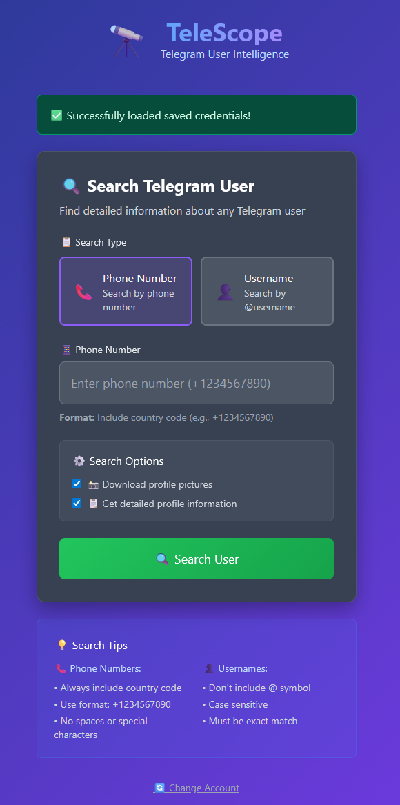
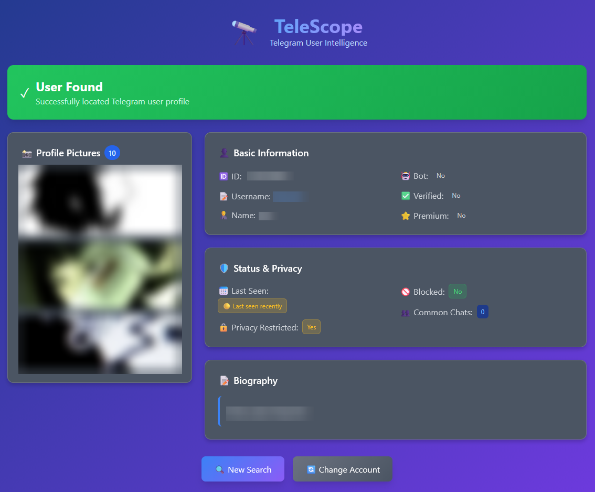

# TeleScope 🔭

A simple Telegram OSINT tool that lets you search user profiles by phone number or username and view their details, privacy status, and profile photos.

p align="center">
  
</p>

<p align="center">
  
</p>

---

## What it does

TeleScope helps you explore Telegram profiles using the official API. Once you're logged in, you can search for any user and see:

- **Full Profile Info** – ID, name, username, phone number (if visible)
- **Privacy Indicators** – last seen status, if blocked, restricted visibility
- **Profile Media** – preview and download all visible historic profile pictures
- **Status Flags** – bot, verified, premium, fake, and common chats
- **User Bio** – pull bio descriptions when available

---

## How to use

1. **Get your Telegram API credentials**
   - Visit [my.telegram.org](https://my.telegram.org)
   - Create a new app to obtain your `API ID` and `API Hash`

2. **Run the tool**

```bash
git clone https://github.com/robertaitch/telescope.git
cd telescope
pip install -r requirements.txt
python app.py
```

3. **Authenticate**
   - Enter your API credentials and phone number
   - Enter the 5-digit verification code sent to your Telegram app

4. **Start searching**
   - Look up users by phone or username
   - Get structured profile results instantly

---

## Features

- Clean interface
- Profile photo gallery with zoom viewer
- Session memory and saved login option (locally stored)
- Detailed result cards with status badges and color indicators
- 100% client-run — no external tracking or third-party requests

---

## Installation

```bash
git clone https://github.com/robertaitch/telescope.git
cd teleScope
pip install -r requirements.txt
python app.py
```

Then open `http://localhost:5000` in your browser.

---

## Legal & Disclaimer

⚠️ **For educational and investigative research only**

- Do not use for harassment, stalking, or illegal purposes
- This tool does not bypass Telegram’s privacy settings
- Saved credentials are only stored on your own device
- You are responsible for any usage — always comply with Telegram’s [Terms of Service](https://telegram.org/tos)

---

## Why I built this

TeleScope was built to be a lightweight and powerful OSINT tool for Telegram — without using unreliable third-party services or scraping. By using Telethon and Telegram’s official API, it gives investigators and researchers a safe and ethical way to access useful profile data, including all historic profile pictures.
---

Built with ❤️ for ethical OSINT.
